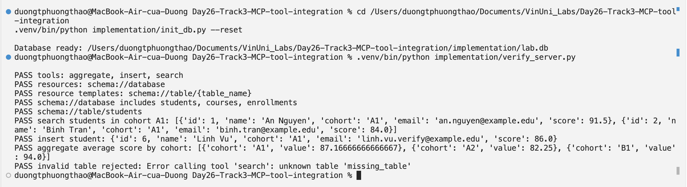
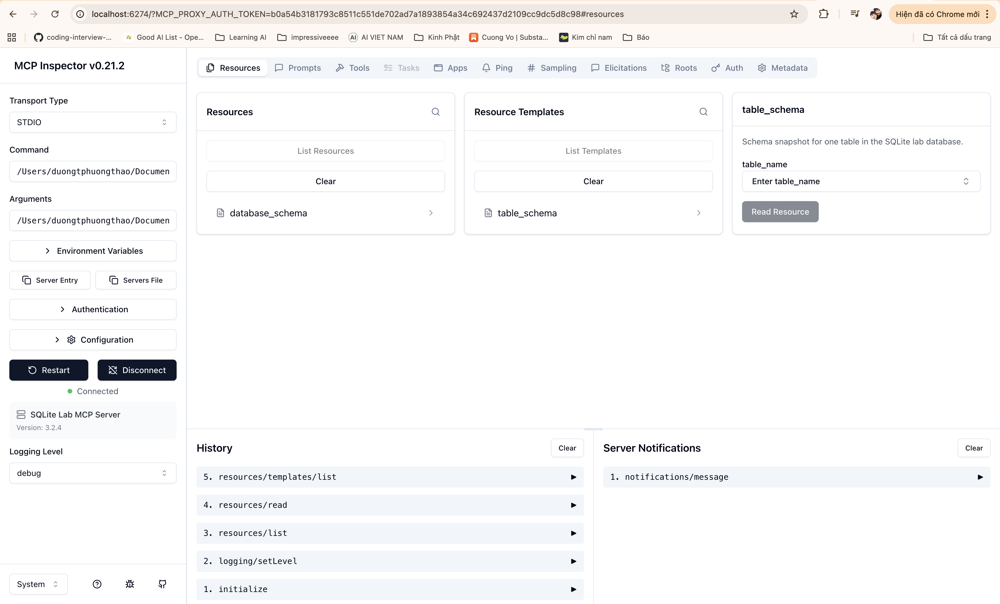
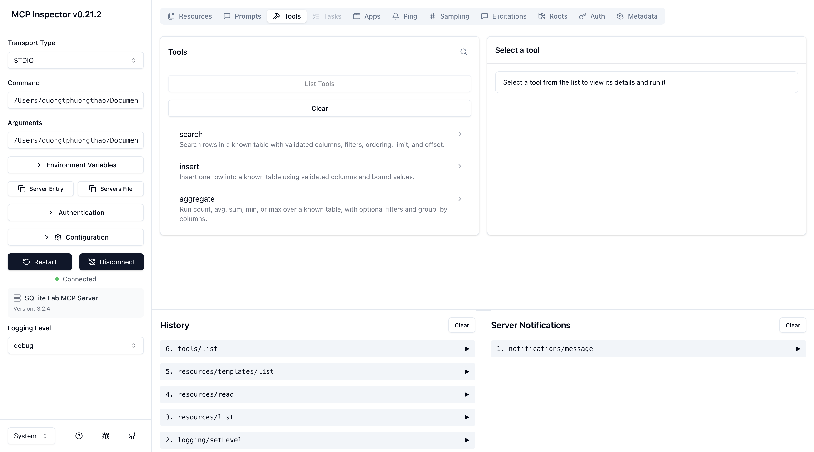
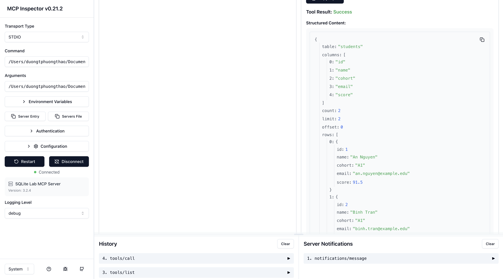
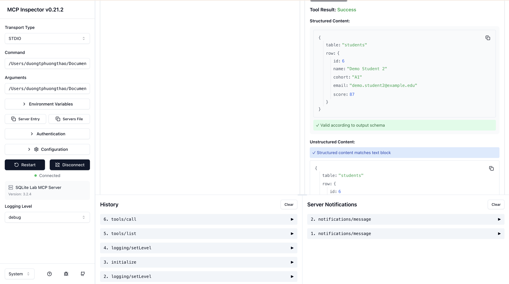
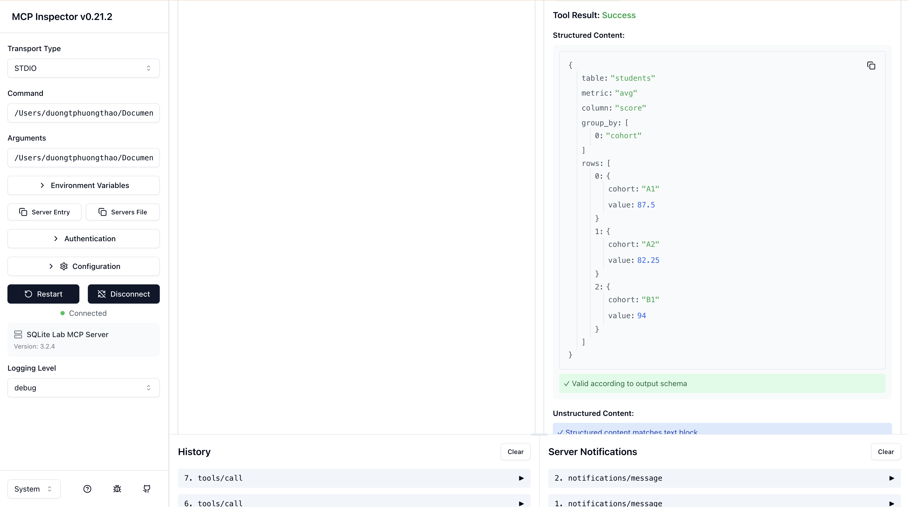

# Demo: SQLite FastMCP Lab Server

File này giải thích các ảnh demo trong thư mục `demo/`. Các ảnh cho thấy MCP server đã chạy được, MCP Inspector kết nối thành công, các tools/resources được discover, và các tool calls trả kết quả đúng.

## 1. CLI Verification



Ảnh này chứng minh server có thể được kiểm tra tự động bằng script:

```bash
.venv/bin/python implementation/verify_server.py
```

Kết quả `PASS` cho thấy:

- MCP client kết nối được với server qua stdio.
- Ba tools `search`, `insert`, `aggregate` được discover.
- Resource `schema://database` và template `schema://table/{table_name}` được discover.
- Các lời gọi hợp lệ như search, insert, aggregate đều chạy thành công.
- Request sai như bảng `missing_table` bị từ chối bằng lỗi rõ ràng.

## 2. Schema Resources In MCP Inspector



Ảnh này nằm ở tab **Resources** trong MCP Inspector. Server đang kết nối thành công qua transport `STDIO`.

Mục **Resources** hiển thị `database_schema`, tương ứng với resource:

```text
schema://database
```

Mục **Resource Templates** hiển thị `table_schema`, tương ứng với dynamic resource:

```text
schema://table/{table_name}
```

Điều này chứng minh server expose được schema context theo yêu cầu lab.

## 3. Tool Discovery In MCP Inspector



Ảnh này nằm ở tab **Tools** sau khi bấm **List Tools**.

Inspector discover được đúng ba tools chính:

- `search`
- `insert`
- `aggregate`

Đây là phần chứng minh MCP server expose đúng tool surface mà rubric yêu cầu.

## 4. Search Tool Success



Ảnh này cho thấy tool `search` chạy thành công.

Demo query tìm sinh viên trong cohort `A1`, giới hạn 2 dòng và sắp xếp theo `score`. Kết quả trả về:

- `An Nguyen`, score `91.5`
- `Binh Tran`, score `84.0`

Ảnh này chứng minh `search` hỗ trợ filter, ordering và pagination.

## 5. Insert Tool Success



Ảnh này cho thấy tool `insert` chạy thành công.

Một sinh viên mới được thêm vào bảng `students`:

```json
{
  "id": 6,
  "name": "Demo Student 2",
  "cohort": "A1",
  "email": "demo.student2@example.edu",
  "score": 87
}
```

Server trả lại payload của row vừa insert, bao gồm `id` do SQLite tự sinh.

## 6. Aggregate Tool Success



Ảnh này cho thấy tool `aggregate` chạy thành công với metric `avg`.

Request tính điểm trung bình theo `cohort`:

```json
{
  "table": "students",
  "metric": "avg",
  "column": "score",
  "group_by": "cohort"
}
```

Kết quả hiển thị average score cho các cohort:

- `A1`: `87.5`
- `A2`: `82.25`
- `B1`: `94`

Ảnh này chứng minh `aggregate` hỗ trợ metric hữu ích và grouping.

## Demo Script Suggested Flow

Khi quay video demo khoảng 2 phút, trình bày theo thứ tự sau:

1. Mở terminal và chạy `implementation/verify_server.py`.
2. Mở MCP Inspector, cho thấy server đang `Connected`.
3. Vào tab **Resources**, show `database_schema` và `table_schema`.
4. Vào tab **Tools**, bấm **List Tools** để show `search`, `insert`, `aggregate`.
5. Chạy `search` để tìm students trong cohort `A1`.
6. Chạy `insert` để thêm một student mới.
7. Chạy `aggregate` để tính average score theo cohort.
8. Nhắc rằng server có validation cho table name, column name, filter operator, aggregate metric và empty insert.

## Rubric Mapping

- Server foundation: ảnh 1 cho thấy database và verification script chạy được.
- Required tools: ảnh 3, 4, 5, 6 cho thấy ba tools discover và chạy thành công.
- MCP resources: ảnh 2 cho thấy full schema resource và per-table schema template.
- Verification: ảnh 1 là smoke test tự động; ảnh 4-6 là manual verification bằng Inspector.
- Client integration: MCP Inspector kết nối qua stdio và gọi tools thành công.
